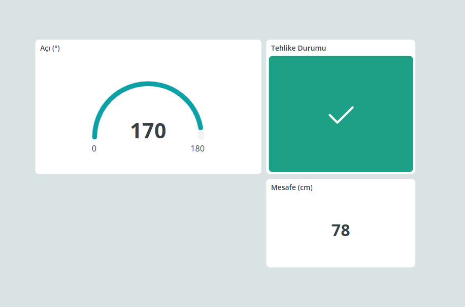

# IoT Destekli Akıllı Radar Sistemi
---
Arduino ve ESP8266 ile geliştirilen bu sistem, ultrasonik sensör ve servo motor kullanarak 180 derecelik bir tarama yapar. Çevredeki nesnelerin mesafesini ölçer ve verileri gerçek zamanlı olarak IoT platformuna aktarır.
---
## WiFi Bilgilerini Güncelleyin
   1. `arduino_secrets.h` dosyasını düzenleyin**
     ```cpp
     #define SECRET_SSID "WiFi_SSID'iniz"
     #define SECRET_OPTIONAL_PASS "WiFi_Şifreniz"
     #define SECRET_DEVICE_KEY "IoT_Cloud_Device_Key"
     ```
   2. `thingProperties.h` dosyasını düzenleyin**
     ```cpp
     const char DEVICE_LOGIN_NAME[]  = "CIHAZ_LOGIN_ID";
     ```
---
## Ekran Görüntüsü


---

## Lisans

Bu proje MIT Lisansı ile lisanslanmıştır. Daha fazla bilgi için [LICENSE](LICENSE) dosyasını inceleyin.

---